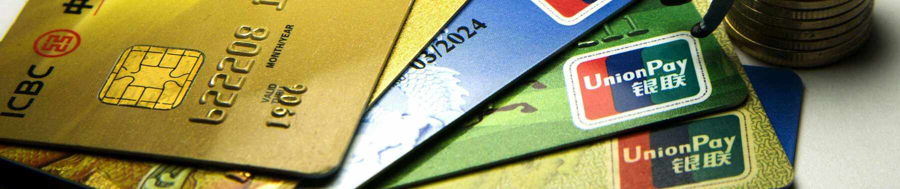

# Predict Credit Card Approval

In today's dynamic financial landscape, credit card companies encounter the challenge of efficiently and accurately assessing creditworthiness to mitigate risk and optimize profitability. The manual evaluation of credit card applications can be time-consuming and susceptible to human error. To tackle this issue, our project aims to develop a predictive model for credit card approval using advanced machine learning techniques. Our project takes a leap forward by not only developing a predictive model for credit card approval but also building a user-friendly application.This application, created using Python and Streamlit, empowers users to predict whether a credit card application will be approved or not based on the applicant's data.

### Deployed Application link
+ https://preditct-credit-card-appoval.onrender.com/
+ https://deploypredictcreditcardapproval.streamlit.app/

